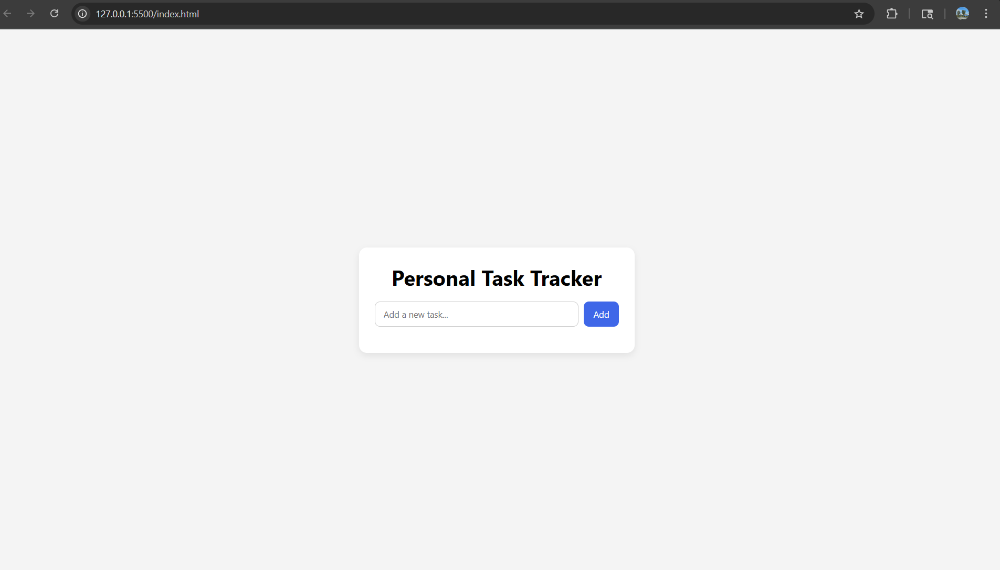
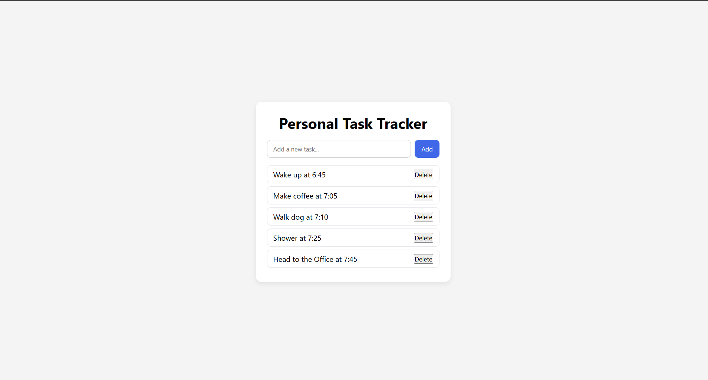
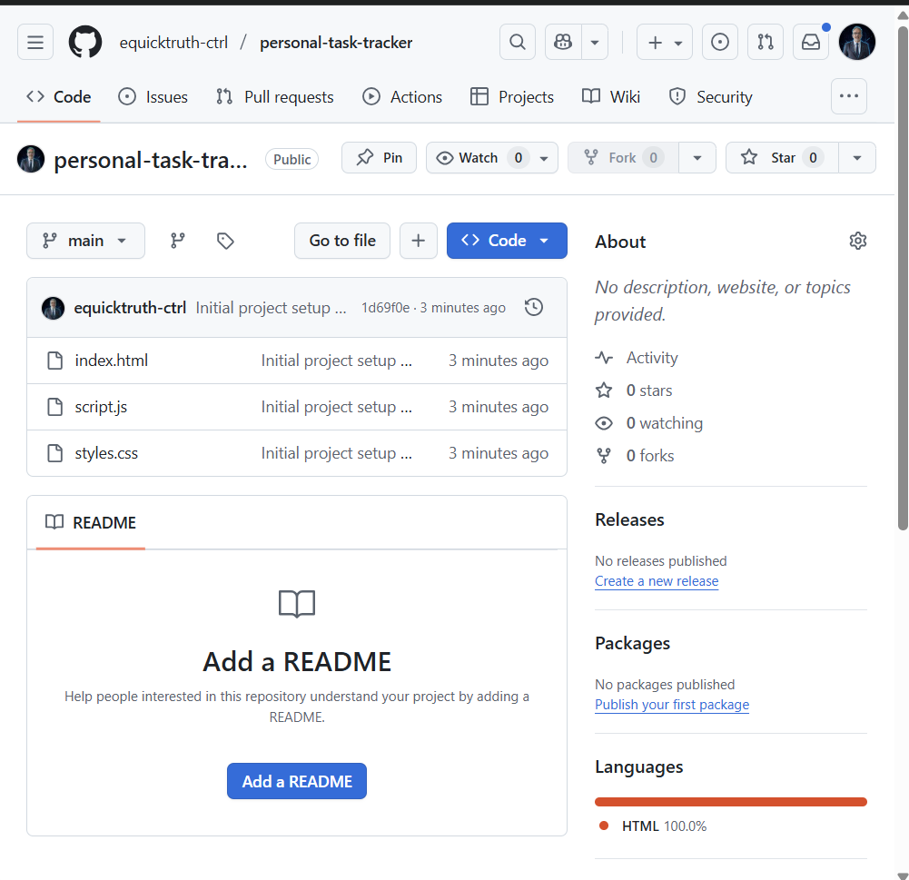

# Personal Task Tracker

Built by Erik V.

## Live Demo

View the app here: https://equicktruth-ctrl.github.io/personal-task-tracker/

## How to Run Locally

1. Clone the repo.
2. Open `index.html` in a browser.

A simple, responsive task tracking web app built with HTML, CSS, and vanilla JavaScript. Tasks are stored in localStorage so they persist between browser sessions.

## Features

- Add tasks using the input field and button.
- Delete individual tasks from the list.
- Automatically saves tasks in localStorage so they remain after closing the browser.
- Mobile-friendly layout with a centered card-style design.

## Tech Stack

- HTML
- CSS (responsive layout)
- JavaScript (DOM manipulation, localStorage)
- GitHub Pages (deployment)

## Screenshots

Main UI:

Task list with saved items:

Repository setup:

